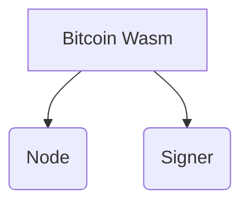

[](https://github.com/rust-secure-code/safety-dance/)

# Bitcoin-Wasm

**Bitcoin Wasm** is a **WASM-WASI compliant** embedded Bitcoin payment node. It's designed to be embedded in native applications using WASI-compliant runtime SDKs like **wasmtime** and **JCO**. This node provides all the necessary functionalities to send, receive, and convert Bitcoin in a non-custodial way using open standards. 


## :ledger: Index

- [About](#beginner-about)
- [Features](#feat-features)
- [Usage](#zap-usage)
  - [Installation](#electric_plug-installation)
  - [Commands](#package-commands)
- [Development](#wrench-development)
  - [Pre-Requisites](#notebook-pre-requisites)
  - [Developmen Environment](#nut_and_bolt-development-environment)
  - [File Structure](#file_folder-file-structure)
  - [Build](#hammer-build)  
  - [Deployment](#rocket-deployment)  
- [Community](#cherry_blossom-community)
  - [Contribution](#fire-contribution)
  - [Branches](#cactus-branches)
  - [Guideline](#exclamation-guideline)  
- [FAQ](#question-faq)
- [Resources](#page_facing_up-resources)
- [Gallery](#camera-gallery)
- [Credit/Acknowledgment](#star2-creditacknowledgment)
- [License](#lock-license)

##  :beginner: About

Bitcoin Wasm contains two sub-projects: the embeddable, self-contained Bitcoin Light Client called **Node** and the Bitcoin Transaction Signing Utility Software called **Signer**.




### Node

Node is a self-contained Bitcoin Light Client that provides essential functionalities for interacting with the Bitcoin network. Its key features include:

* **Transaction Broadcasting:** Node enables the transmission of Bitcoin transactions to the network through peer-to-peer (P2P) communication.
* **Receive Transaction:** Node effectively receives and processes incoming Bitcoin transactions from the network, utilizing efficient block filtering techniques to minimize data overhead.
* **Currency Conversion:** Node facilitates the seamless conversion of Bitcoin to and from local currencies by leveraging the capabilities of the tbDEX exchange platform. This feature provides users with the flexibility to exchange Bitcoin for their preferred fiat currencies.

### Signer

Signer is a powerful utility that handles the cryptographic aspects of Bitcoin transactions. Its key functionalities include:

* **Bitcoin Transaction Signing:** Signer utilizes the PSBT (Partially Signed Bitcoin Transaction) format to securely sign Bitcoin transactions.
* **Bitcoin Key Management:** It stores and manages private keys, ensuring the safekeeping of Bitcoin signing primitives.
* **tbDEX Message Signing:** Signer supports the signing of tbDEX messages using the JSON format.
* **tbDEX Key Management:** It stores and manages JWKs (JSON Web Keys), which are essential for signing and verifying tbDEX messages.


## :station: Features
- [ ] Light Client (Compact Block Filtering)
- [ ] Descriptor Wallet 
- [ ] Silent Payment Support
- [ ] tbDEX exchange feature
- [ ] Wasm Signer
  - [ ] PSBT support
   
## :zap: Usage
The project is intended to be used in another project with the help of WASI SDK such as wasmtime. 

###  :electric_plug: Installation
- Steps on how to install this project, to use it.
- Be very detailed here, For example, if you have tools which run on different operating systems, write installation steps for all of them.

```
$ add installations steps if you have to.
```

###  :package: Commands
- Commands to start the project.

##  :wrench: Development
If you want other people to contribute to this project, this is the section, make sure you always add this.

### :notebook: Pre-Requisites
List all the pre-requisites the system needs to develop this project.
- A tool
- B tool

###  :nut_and_bolt: Development Environment
Write about setting up the working environment for your project.
- How to download the project...
- How to install dependencies...


###  :file_folder: File Structure
Add a file structure here with the basic details about files, below is an example.

```
.
├── crates
│   ├── store
│   │   ├── src
│   │   └── wit
|   |   |  └──world.wit
|   |   ├── Cargo.toml
├── Node
│   ├── src
│   │   ├── lib.rs
│   │   └── binding.rs
│   └── cargo.toml
├──test-programs 
│   ├── artifacts
│   |   ├── src
│   │   └── wit
|   |   |  └──world.wit
|   |   └── Cargo.toml
|   ├── runner
│   |   ├── src
│   │   └── wit
|   |   |  └──world.wit
|   |   └── build.rs
└── Cargo.toml

```

| No | File Name | Details 
|----|------------|-------|
| 1  | index | Entry point

###  :hammer: Build
Write the build Instruction here.

### :rocket: Deployment
Write the deployment instruction here.

## :cherry_blossom: Community

If it's open-source, talk about the community here, ask social media links and other links.

 ###  :fire: Contribution

 Your contributions are always welcome and appreciated. Following are the things you can do to contribute to this project.

 1. **Report a bug** <br>
 If you think you have encountered a bug, and I should know about it, feel free to report it [here]() and I will take care of it.

 2. **Request a feature** <br>
 You can also request for a feature [here](), and if it will viable, it will be picked for development.  

 3. **Create a pull request** <br>
 It can't get better then this, your pull request will be appreciated by the community. You can get started by picking up any open issues from [here]() and make a pull request.

 > If you are new to open-source, make sure to check read more about it [here](https://www.digitalocean.com/community/tutorial_series/an-introduction-to-open-source) and learn more about creating a pull request [here](https://www.digitalocean.com/community/tutorials/how-to-create-a-pull-request-on-github).


 ### :cactus: Branches

 I use an agile continuous integration methodology, so the version is frequently updated and development is really fast.

1. **`stage`** is the development branch.

2. **`master`** is the production branch.

3. No other permanent branches should be created in the main repository, you can create feature branches but they should get merged with the master.

**Steps to work with feature branch**

1. To start working on a new feature, create a new branch prefixed with `feat` and followed by feature name. (ie. `feat-FEATURE-NAME`)
2. Once you are done with your changes, you can raise PR.

**Steps to create a pull request**

1. Make a PR to `stage` branch.
2. Comply with the best practices and guidelines e.g. where the PR concerns visual elements it should have an image showing the effect.
3. It must pass all continuous integration checks and get positive reviews.

After this, changes will be merged.


### :exclamation: Guideline
coding guidelines or other things you want people to follow should follow.


## :question: FAQ
You can optionally add a FAQ section about the project.

##  :page_facing_up: Resources
Add important resources here

##  :camera: Gallery
Pictures of your project.

## :star2: Credit/Acknowledgment
Credit the authors here.

##  :lock: License
Add a license here, or a link to it.