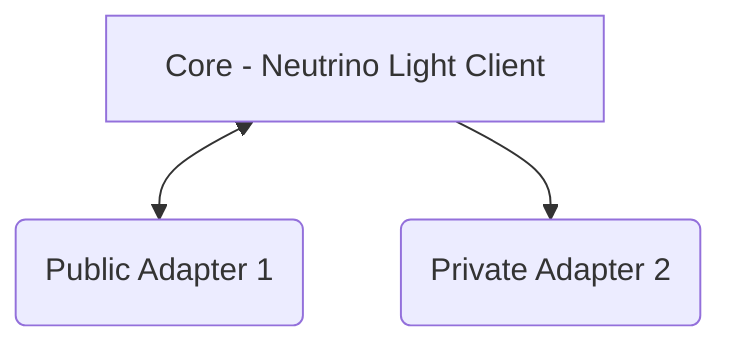

[](https://github.com/rust-secure-code/safety-dance/)

# Bitcoin-Wasm

## :beginner: Why Bitcoin-WASM ?

**Bitcoin Wasm** consists of a  universally embeddable and composable _Bitcoin Payment Node_  which  is designed to be embedded in a variety of applications using WASI-compliant runtime SDKs like **wasmtime** and **JCO**. At the Centre Of Bitcoin-WASM is a Neutrino Bitcoin Light Client , which is a form of Simple Payment Verification Mechanism and serves as a base that can be extended upon with a diverse range of functionalities which we call __adapters__ which can be open-source or proprietary examples are tbDEX protocol, Silent Payments .




### Design Decision
To be pluggable, bitcoin-WASM must adhere to a few concrete design constraints; these constraints are required due to the host system's zero knowledge approach, which would embed bitcoin-WASM. 

- Minimal Software Resource Consumption.

- Usage of Only decentralized Protocols and Systems.

- The absence of private information storage.

### Core -Neutrino Light Client

A Bitcoin Neutrino Light Client is a simplified version of a full Bitcoin node that allows users to interact with the Bitcoin network without downloading and verifying the entire blockchain.

Here's a breakdown of its key features:

- Lightweight: Neutrino clients only download and store a small portion of the blockchain, making them suitable for devices with limited storage and processing power.

- Fast Synchronization: Neutrino clients can synchronize with the Bitcoin network much faster than full nodes, allowing users to start interacting with the network quickly.

- Limited Functionality: While Neutrino clients can verify transactions and block headers, they do not provide full node functionality like mining or running a full archive node.

- Dependency on Full Nodes: Neutrino clients rely on a network of full nodes to verify the validity of transactions and blocks.


## :station: Open Source Adapters

- [x] Key Value Store (Implemented)
- [ ] Deterministic wallet (inprogress)
- [ ] Singing Device (not started)
- [ ] Ark Protocol (In Research)


##  Why Webassembly ?
Using WebAssembly (Wasm) to create Bitspend core has several advantages, especially in contexts where performance, security, and portability are key concerns. Here’s why Wasm is a great fit for building Bitspend core:

Efficient resource usage: Wasm is designed to be compact and fast, meaning plugins written in Wasm can load and execute more quickly, enhancing the user experience.

Sandboxed execution: One of the biggest advantages of WebAssembly for plugins is its secure sandboxing model. Plugins written in Wasm run in an isolated environment with limited access to the host system, reducing the risk of malicious plugins or vulnerabilities.

Memory safety: Wasm offers built-in protections against common security issues like buffer overflows, which are common in low-level languages like C/C++. This memory safety makes it a more secure choice for plugin development.

Plugins as lightweight modules: Wasm allows you to create small, efficient modules that can easily be plugged into larger systems, whether web apps, desktop software, or server applications. These modules can be loaded and executed on-demand, reducing overall application size and improving performance.

Fine-grained control: Plugins developed in WebAssembly can be tightly controlled by the host environment. This includes managing memory, enforcing strict execution limits, and restricting access to system resources. This level of control helps in developing secure, stable plugins that don’t interfere with the host.


## :zap: Usage

The executables are WASM modules which are designed to be embedded within applications using WASI runtime like wasmtime.


## :wrench: Development

We warmly welcome your contributions to Bitcoin Wasm! Whether you're a seasoned developer or just starting out, your help can make a significant impact.

### :notebook: Pre-Requisites

- Rust compiler (v1.78 or later) - [Install](https://www.rust-lang.org/tools/install)
- WASI runtime SDK (e.g., wasmtime) - [Install](https://docs.wasmtime.dev/cli-install.html)

### :nut_and_bolt: Development Environment

A. **Setting Up Your Development Environment**

1. **Clone the Repository:**

   ```bash
   $ git clone https://github.com/aruokhai/bitcoin-wasm.git
   ```

2. Navigate to the project directory:

   ```bash
   $ cd bitcoin-wasm
   ```

3. Install Cargo Component:

   ```bash
   $ cargo install cargo-component
   ```

4. Install `wac-cli` used for building wasm  :

   ```bash
   $ cargo install wac-cli
   ```


B. **Running Tests**

To run the project's integration tests, follow these steps:

1. [Install Docker Engine](https://docs.docker.com/engine/install/)

2. Run the integration tests:

   ```bash
   $ cd tests
   $ ./test-runner.sh
   ```

### :file_folder: Folder Structure

```
bitcoin-wasm
├── crates
│   ├── store
│   │   ├── src
│   │   └── wit
|   |   |  └──world.wit
|   |   ├── Cargo.toml
│   ├── tbdex
│   │   ├── src
│   │   └── wit
|   |   |  └──world.wit
|   |   ├── Cargo.toml
├── Node
│   ├── src
│   │   ├── lib.rs
│   │   └── binding.rs
│   └── wit
|   |   └──world.wit
│   └── cargo.toml
├──tests
│   ├── artifacts
│   |   ├── src
│   │   └── wit
|   |   |  └──world.wit
|   |   └── Cargo.toml
│   ├── cli
|   ├── runner
│   |   ├── src
│   │   └── wit
|   |   |  └──world.wit
|   |   └── build.rs
└── Cargo.toml

```

Here's a breakdown of the key folders:

- **crates:** This folder holds open source adapters that are free to use, such as:
   - **store:** A generic key-value store.
   - **tbdex:** The tbDex protocol.

- **node:** This is the core that contains the neutrino light client which uses Compact  Block Filtering.

- **test:** This folder holds integration tests used to verify the functionality of the project. It contains two subfolders:
  - **artifacts:** This contains various components test logic.
  - **runner:** The main entry point for the integration test.

### :hammer: Build

There is currently one way to build the Bitcoin-Wasm project:

1. **Building a specific component:**
   You can build a specific component, like the `web5` package, using the following command:

   ```bash
   $ cargo-component build --package=<package-name>
   ```

   Replace `package-name` with the actual name of the package you want to build (e.g `web5`).

### :office: Usage

An example of the usage of the `Node` plugin can be found in the `examples` folder. Which includes a dummy mobile money CLI application created for the TBDX 2024 Hackathon.


## :cherry_blossom: Community

If it's open-source, talk about the community here, ask social media links and other links.

### :fire: Contribution

Your contributions are always welcome and appreciated. Following are the things you can do to contribute to this project.

1.  **Report a bug** <br>
    If you think you have encountered a bug, and I should know about it, feel free to report it [here]() and I will take care of it.

2.  **Request a feature** <br>
    You can also request for a feature [here](), and if it will viable, it will be picked for development.

3.  **Create a pull request** <br>
    It can't get better then this, your pull request will be appreciated by the community. You can get started by picking up any open issues from [here]() and make a pull request.

> If you are new to open-source, make sure to check read more about it [here](https://www.digitalocean.com/community/tutorial_series/an-introduction-to-open-source) and learn more about creating a pull request [here](https://www.digitalocean.com/community/tutorials/how-to-create-a-pull-request-on-github).

### :cactus: Branches

I use an agile continuous integration methodology, so the version is frequently updated and development is really fast.

1. **`stage`** is the development branch.

2. **`master`** is the production branch.

3. No other permanent branches should be created in the main repository, you can create feature branches but they should get merged with the master.

**Steps to work with feature branch**

1. To start working on a new feature, create a new branch prefixed with `feat` and followed by feature name. (ie. `feat-FEATURE-NAME`)
2. Once you are done with your changes, you can raise PR.

**Steps to create a pull request**

1. Make a PR to `stage` branch.
2. Comply with the best practices and guidelines e.g. where the PR concerns visual elements it should have an image showing the effect.
3. It must pass all continuous integration checks and get positive reviews.

After this, changes will be merged.

### :exclamation: Guideline

- Follow Rust's style guidelines and best practices.
- Write clear and concise commit messages.
- Ensure your code passes all tests.
- Review and provide feedback on other contributors' pull requests.

## :page_facing_up: Resources

- **WASM Specification:** [https://webassembly.org/](https://webassembly.org/)
- **WASI Specification:** [https://wasi.dev/](https://wasi.dev/)
- **Bitcoin Documentation:** [https://bitcoin.org/](https://bitcoin.org/)
